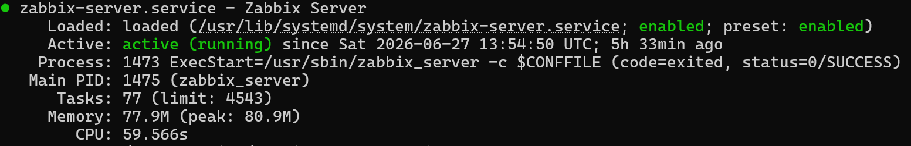

# Zabbix 7.0 LTS — Infrastructure Monitoring Lab

Designed, deployed, and configured a production-style infrastructure monitoring environment using **Zabbix 7.0 LTS** on **Ubuntu Server 24.04 LTS**, monitoring Linux and Windows hosts through **Zabbix Agent**, **SNMP**, and **Simple Checks**. The project includes reusable monitoring templates, intelligent trigger logic, automated email alerting, and role-based access control (RBAC).

> **Built independently from the ground up.** Installation, networking, database, and configuration issues were diagnosed and resolved through Linux server logs and systematic troubleshooting rather than following a step-by-step tutorial.

---

# 🎯 Project Objectives

* Deploy Zabbix Server 7.0 LTS on Ubuntu Server 24.04 LTS
* Monitor Linux and Windows systems using multiple monitoring methods
* Configure Zabbix Agent, SNMP, and Simple Checks
* Create reusable monitoring templates
* Build intelligent trigger expressions to reduce false alarms
* Configure automated email notifications
* Practice real-world Linux and infrastructure troubleshooting
* Simulate a small Network Operations Center (NOC) monitoring environment

---

# 🛠️ Skills Demonstrated

* Linux System Administration
* Infrastructure Monitoring
* Zabbix 7.0 LTS
* Ubuntu Server
* Windows Administration
* SNMP
* Zabbix Agent2
* Low-Level Discovery (LLD)
* Trigger Expressions
* VMware Workstation Pro
* MySQL 8
* Nginx
* PHP-FPM
* SMTP Email Alerting
* Network Troubleshooting
* Role-Based Access Control (RBAC)

---

# 📸 Dashboard


---

# 🖥️ Technology Stack

| Component           | Details                              |
| ------------------- | ------------------------------------ |
| Monitoring Platform | Zabbix 7.0.27 LTS                    |
| Server OS           | Ubuntu Server 24.04 LTS              |
| Database            | MySQL 8                              |
| Web Server          | Nginx + PHP 8.3-FPM                  |
| Hypervisor          | VMware Workstation Pro               |
| Monitored Devices   | Ubuntu Server VM + Windows 11 Laptop |

---

# 🏗️ Architecture

```text
                        Windows 11 Laptop
                        (Zabbix Agent2)
                               │
                               │
                               ▼
                   Ubuntu Server 24.04 LTS
        ┌──────────────────────────────────────────┐
        │             Zabbix Server                │
        │                                          │
        │ • Zabbix Server                          │
        │ • MySQL Database                         │
        │ • Nginx                                  │
        │ • PHP 8.3-FPM                            │
        │ • Zabbix Agent2                          │
        │ • SNMP Daemon                            │
        └──────────────────────────────────────────┘
                 ▲                    │
                 │                    ▼
             SNMP Queries      Gmail SMTP Alerts
                                       │
                                       ▼
                                 Email Notification
```

---

# 📡 Infrastructure Monitored

## Ubuntu Server 24.04 LTS

* 75+ auto-discovered metrics using Low-Level Discovery (LLD)
* CPU utilization
* Memory availability
* Disk space usage
* Network interface traffic (ens33)
* SNMP monitoring using standard OIDs
* TCP service availability (Simple Checks)

---

## Windows 11 Laptop

* 161 auto-discovered metrics
* CPU utilization
* Memory usage
* Three monitored drives (C:, D:, Y:)
* 78 monitored Windows services
* Qualcomm Atheros QCA9377 Wi-Fi adapter monitoring
* Operating system information
* Uptime
* Running processes
* Logged-in users

---

## Monitoring Summary

| Metric           | Value   |
| ---------------- | ------- |
| Monitoring Items | **392** |
| Triggers         | **226** |
| Monitored Hosts  | **3**   |

---

# ⚡ Key Features

## 1. Multiple Monitoring Methods

| Method            | Purpose                                                                                                                       |
| ----------------- | ----------------------------------------------------------------------------------------------------------------------------- |
| **Zabbix Agent2** | Collects detailed operating system metrics such as CPU, memory, disk usage, processes, and services.                          |
| **SNMP**          | Collects standard management information using real OIDs, similar to enterprise network devices such as switches and routers. |
| **Simple Checks** | Performs agentless TCP service availability monitoring for external services.                                                 |

---

## 2. Intelligent Trigger Design

Implemented trigger expressions using **`avg()`** over configurable time windows instead of relying solely on **`last()`**.

This approach minimizes false alerts caused by temporary CPU or memory spikes and better reflects monitoring practices used in production NOC environments.

---

## 3. Reusable Monitoring Templates

Created reusable host templates using the **`{HOST.CONN}`** macro.

This allows the same template to be applied across multiple hosts without modifying IP addresses, improving scalability and maintainability.

---

## 4. Automated Email Alert Pipeline

```text
Problem Detected
       │
       ▼
Trigger Evaluation
       │
       ▼
Action
       │
       ▼
Gmail SMTP
       │
       ▼
Email Alert Received
```

Successfully validated through live email notifications.

---

## 5. Role-Based Access Control (RBAC)

| Role        | Permissions                                             |
| ----------- | ------------------------------------------------------- |
| Super Admin | Full administrative access                              |
| NOC Analyst | Read-only access restricted to Linux Servers host group |

---

## 6. NOC Dashboard

* Linux CPU utilization
* Linux memory availability
* Windows CPU utilization
* Host availability matrix
* Active problems panel
* Severity indicators
* Overall monitoring health (5.92 new values/sec)

---

# 🔧 Troubleshooting & Issues Resolved

| Issue                        | Root Cause                                    | Resolution                                                 |
| ---------------------------- | --------------------------------------------- | ---------------------------------------------------------- |
| Dependency failures          | Incorrect Ubuntu version installed            | Rebuilt VM using Ubuntu Server 24.04 LTS                   |
| MySQL authentication failure | Incorrect database password                   | Reset password using `ALTER USER` and updated `DBPassword` |
| Missing packages             | Universe and Multiverse repositories disabled | Enabled required repositories before installation          |
| No IPv4 connectivity         | VMware networking configuration               | Reconfigured VMware networking to restore connectivity     |

---

# 📁 Repository Contents

```text
zabbix-monitoring-lab/
│
├── new dashboard.png
├── active.png
├── CLI image.png
├── email.png
├── laptop 2 data.png
├── nginx.conf
├── zabbix_server.conf
└── README.md
```

---

# 📸 Screenshots

## Dashboard


---

## Zabbix Server Status



---

## SNMP Verification


---

## Email Alert


---

## Windows Monitoring


---

# 🛠️ Installation Summary

```bash
# 1. Add Zabbix repository
wget https://repo.zabbix.com/zabbix/7.0/ubuntu/pool/main/z/zabbix-release/zabbix-release_latest_7.0+ubuntu24.04_all.deb
sudo dpkg -i zabbix-release_latest_7.0+ubuntu24.04_all.deb
sudo apt update

# 2. Install Zabbix components
sudo apt install zabbix-server-mysql zabbix-frontend-php zabbix-nginx-conf zabbix-sql-scripts zabbix-agent2 -y

# 3. Create database
sudo mysql
CREATE DATABASE zabbix CHARACTER SET utf8mb4 COLLATE utf8mb4_bin;
CREATE USER 'zabbix'@'localhost' IDENTIFIED BY 'yourpassword';
GRANT ALL PRIVILEGES ON zabbix.* TO 'zabbix'@'localhost';
SET GLOBAL log_bin_trust_function_creators = 1;
QUIT;

# 4. Import schema
sudo zcat /usr/share/zabbix-sql-scripts/mysql/server.sql.gz | mysql -u zabbix -p zabbix

# 5. Start services
sudo systemctl restart zabbix-server zabbix-agent2 nginx php8.3-fpm
sudo systemctl enable zabbix-server zabbix-agent2 nginx php8.3-fpm
```

---

# 👤 Author

**Nafiul Islam Diganta**

ECE Graduate — BRAC University, Dhaka, Bangladesh

[LinkedIn](https://linkedin.com/in/nafiul-islam-diganta) | [GitHub](https://github.com/nafiul-islam-diganta)
